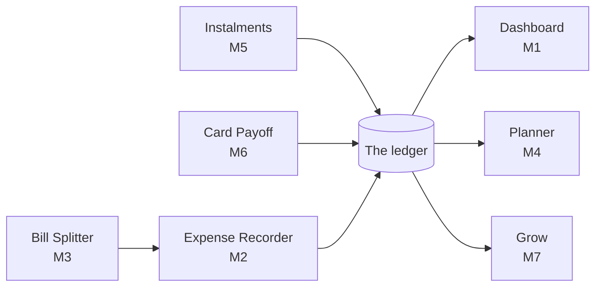
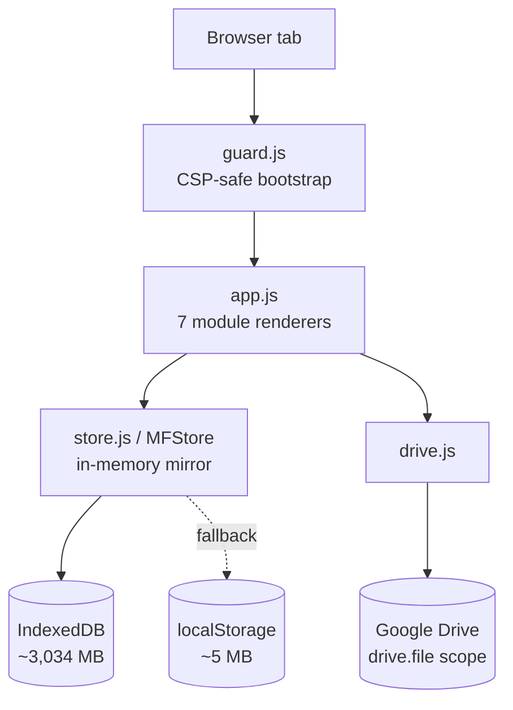

# MoneyFlow — Project Proposal

**Personal Financial Management System**

23 September 2026 · Kaon · Revision 2

*A formatted edition of this proposal, with a cover page, contents and diagrams, sits beside it as [MoneyFlow-Project-Proposal.docx](MoneyFlow-Project-Proposal.docx) and [MoneyFlow-Project-Proposal.pdf](MoneyFlow-Project-Proposal.pdf). This Markdown file is the source; the two are generated from it.*

## Executive summary

MoneyFlow is a browser-based personal financial management system for Malaysian households: one ledger, eight modules reading from it, no server, no account and no monthly fee. A working build is already live at [kaonhew02.github.io/MoneyFlow](https://kaonhew02.github.io/MoneyFlow/), carrying seven delivered modules across roughly 22,200 lines of hand-written HTML, CSS and JavaScript with no build step and no JavaScript libraries. As of 23 September 2026 it also runs under a strict Content-Security-Policy, treats every backup file as hostile until checked, and leaves nothing of itself reachable from the browser console.

The product exists because the tools that already do this either want a bank login, a subscription, or both — and a household ledger is the last thing that should live on somebody else's server for RM 15 a month.

|  |  |
| --- | --- |
| Product | MoneyFlow — *Understand Your Money. Manage Your Future.* |
| Category | Personal financial management system (PFMS) |
| Primary user | Malaysian individuals and households tracking day-to-day money in ringgit |
| Delivered | 7 of 8 modules live; multi-currency entry built into the ledger |
| Stack | Static site on GitHub Pages · IndexedDB · optional Google Drive copy |
| Security | Strict Content-Security-Policy · sanitised backups · no app state on `window` |
| Dependencies | No npm packages, no build step, no bundler, no API keys; two CDN assets |
| Running cost | RM 0/month — hosting, storage and backup are all free tiers or the user's own disk |
| Effort to date | 48 commits, 18 Aug 2026 – 23 Sep 2026 |
| Proposed next phase | 12 weeks: finish M8, harden the backup story, close the multi-device gap |

**The ask.** Approval to run the twelve-week Phase 4 in [Project plan and timeline](#project-plan-and-timeline) at the resourcing set out in [Resources and budget](#resources-and-budget) — one developer, part-time, and RM 0–84 of annual infrastructure depending on whether the multi-device option is taken up.

## Background and problem statement

The problem is not that personal finance software does not exist — it is that every option asks a household to give up something it should not have to. Bank linking wants credentials. Subscriptions want RM 10–25 a month forever for arithmetic. Free apps want the ledger itself, which is the single most revealing document a household owns: salary, rent, debt, habits, and who was at dinner.

MoneyFlow began in August 2026 as **Money Splitor**, a single-purpose tool for dividing a restaurant bill. The scope problem surfaced immediately: a split bill is an expense, an expense belongs in a ledger, and a ledger is worthless without a budget to measure it against. On 18 August 2026 the project was renamed and re-scoped into an eight-module PFMS meant to be used for years rather than for one dinner.

### What the alternatives get wrong

| Option | What it costs the user |
| --- | --- |
| Bank-linked aggregators | Credentials handed to a third party; Malaysian bank coverage is partial, so half the accounts are typed in anyway |
| Subscription trackers | RM 120–300 a year, and the data leaves with the subscription when it lapses |
| Free ad-funded apps | The ledger becomes the product; export is usually crippled or paid |
| Double-entry accounting (GnuCash, Ledger-CLI) | Correct, and unusable for someone who just wants to know where RM 620 of food went |
| A spreadsheet | Free and private, but every report is re-built by hand and one wrong formula is silent |

### The Malaysian gap

International tools are built for other people's receipts. A Malaysian bill has a 10% service charge and 6% SST, and the SST is charged on the food subtotal, **not** on the service charge — an app that taxes the sum overcharges every table. Cards are capped by Bank Negara at 18% a year with a 5%-of-statement minimum and an RM 25 floor. Instalments arrive as SPayLater and 24-month phone plans. Savings arrive as EPF at 11% of salary and ASNB dividends declared once a year against the average monthly balance. None of that is a setting in a foreign app.

### The design flaw underneath all of it

Most trackers store their totals. A monthly summary is written down when the month closes, and from then on there are two versions of the truth — the records, and a figure that was correct once. Every later correction has to find and fix both. MoneyFlow's founding constraint, *record once, analyze many times*, exists to make that class of bug impossible.

## Proposed solution

MoneyFlow is one ledger with eight modules reading from it, delivered as a static web page that keeps every record on the user's own machine. There is no account to create, no server to trust and nothing to cancel.

### Record once, analyze many times

This is the architectural rule the whole system is built on. A single saved transaction — `Food — RM 25 — 17 Aug 2026` — is written once and then serves the daily summary, the August summary, the 2026 yearly view, the Food category analysis, the Maybank balance, the August-vs-July comparison, the dashboard and the budget. **No report ever writes a record, and no total is ever stored.** Every figure on screen is computed from the originals at paint time.

The Dashboard is the clearest expression of it: it has no storage key of its own, and must never get one.



Everything that records money writes into the ledger; everything that analyses money reads back out of it. Arrows never run the other way.

### Three transaction types, and only three

| Type | Effect |
| --- | --- |
| **Income** | Increases one account balance |
| **Expense** | Decreases one account balance |
| **Transfer** | Moves money between two accounts |

A transfer is neither income nor expense. It must never touch total income, total expenses or net spending — it only moves two balances. Getting this wrong is the single most common reason a home ledger stops agreeing with the bank.

### The bucket rule

Every spending category belongs to exactly one of three buckets, which is what makes a 50/30/20 reading possible without asking the user to classify anything twice:

| Bucket | Holds | Target |
| --- | --- | --- |
| **Needs** | Housing, food, transport, bills, insurance, healthcare | 50% |
| **Wants** | Entertainment, and anything the user files there | 30% |
| **Save** | Savings, investment **and debt repayment** | 20% |

Debt sits in `save`, not `needs`. Clearing a card builds net worth exactly the way a deposit does, and 50/30/20 treats it that way. "Total spending" is deliberately `needs + wants` — money that is gone — so the savings rate and the spending percentage never double-count the same ringgit.

### What the user gets that they did not have

- **Privacy by construction.** The records never leave the browser unless the user presses a button. There is no account, no telemetry and no key in the source.
- **No recurring cost.** Hosting is GitHub Pages; storage is the browser; the optional backup is the user's own Google Drive.
- **A folder you can copy.** No build step and no dependencies means the app is a handful of static files that run from any web server, forever, with no toolchain to rot.
- **Malaysian arithmetic that is actually right** — SST on the subtotal, BNM card minimums, EPF and ASNB compounding, delivery and platform fees split apart from the food.

## Objectives and success criteria

The project succeeds if a household can run its money on MoneyFlow for a full year without touching a spreadsheet and without losing a record. Everything below is a test, not an aspiration.

| # | Objective | Measure | Threshold | Status |
| --- | --- | --- | --- | --- |
| O1 | Every module reads one ledger | Stored derived totals anywhere in the codebase | 0 | Met |
| O2 | Recording an expense is fast enough to actually do daily | Keystrokes and clicks from page load to saved entry | ≤ 8 | Met |
| O3 | Money arithmetic is exact | Rounding drift across any split, schedule or payoff run | 0 sen | Met |
| O4 | A transfer never distorts a report | Transfers appearing in income or expense totals | 0 | Met |
| O5 | Malaysian charges match a real receipt | Service charge, SST, cash rounding vs a printed bill | Exact to the sen | Met |
| O6 | The app runs with nothing installed | npm packages, build steps, API keys, CDN scripts it needs to run | 0 of each | Met |
| O7 | The whole book survives a new laptop | Export → Import round trip preserving every store | Byte-identical | Met |
| O8 | A failed write is never silent | Quota or private-mode failures that reach the user | 100% surfaced | Met |
| O9 | Storage headroom | Usable capacity for records | ≥ 500 MB | Met (\~3,034 MB via IndexedDB) |
| O10 | All eight modules delivered | Modules with a working screen | 8 of 8 | 7 of 8 — M8 pending |
| O11 | Records reachable from a phone | Devices that can read the same book | ≥ 2 | **Not met** — see [Risks](#risks-and-mitigations) |
| O12 | Text is readable | WCAG AA contrast on primary text and controls | ≥ 4.5:1 | Met on all primary text |
| O13 | A backup file cannot run code | Script payloads executed from a crafted Import or Drive file | 0 | Met (23 Sep 2026) — was 18 |
| O14 | The records cannot be changed from the console by name | App functions or state reachable on `window` after load | 0 | Met (23 Sep 2026) |

### What "done" means for Phase 4

O10 and O11 are the two open rows, and they are the whole of the proposed next phase. O10 is a module build. O11 is the one requirement the current architecture genuinely cannot satisfy — `localStorage` and IndexedDB are per-origin, per-device, and no amount of care changes that. It is treated as a scoped decision in [Future roadmap](#future-roadmap), not as a defect.

### Explicit non-objectives

These are refused on purpose, and each refusal has a reason that should survive a change of mind:

- **No bank or statement import.** It needs credentials or a paid aggregator, and both undo the privacy claim.
- **No alerts, emails or notifications.** A budget that emails you is a different product.
- **No invented figures.** Late fees are flagged and counted in days, never calculated — the bank decides what it charges, and a number the app made up would sit on screen looking like a fact. The same rule governs unit trust prices and EPF dividends.
- **No budget rollover.** Underspending in August does not raise September. That is an envelope system, and a rolled-over figure is exactly the stored derived value the architecture refuses.

## Target users and personas

The target user is one Malaysian adult managing their own money — salaried, banking across two or three accounts and an e-wallet, carrying one card and one or two instalments. Not a business, not a household accountant, and not somebody who wants to learn double-entry bookkeeping.

| Persona | Situation | What they need | Lives in |
| --- | --- | --- | --- |
| **Aiman, 27 — the tracker** | RM 4,300 into CIMB, spends from Maybank and Touch 'n Go, no idea where RM 2,150 a month goes | A ledger fast enough to fill in at the table, and a month-vs-month answer | M1, M2, M4 |
| **Kaon, 24 — the organiser** | Always the one who puts the card down at hotpot, then chases five people in a group chat | An exact per-person split including service, SST and delivery, and one message to paste | M3, M2 |
| **Mei Ling, 31 — the payer-down** | Phone on 24 months, SPayLater, RM 8,000 on one card, wants it gone | A schedule that shows what is already spoken for, and proof that avalanche beats the minimum | M5, M6 |
| **Hafiz, 35 — the builder** | EPF, ASB, an FD rolling over, a goal for a house deposit | Savings rate against income, and what a holding actually returned | M4, M7 |

One person is usually several of these at once, which is why they are one app and not four.

### Jobs to be done

- *When I have just paid for something, I want to record it in under ten seconds, so that I still do it on the tenth day.*
- *When five of us split three tills, I want the exact handovers, so that nobody argues and nobody is short 40 sen.*
- *When the month ends, I want to know what changed against last month, so that I can do something about it before the next one.*
- *When I am paying off a card, I want to know what the minimum actually costs me, so that I can decide whether to pay more.*
- *When I clear my browser or buy a laptop, I want my records back, so that a year of entries is not a year wasted.*

### Who this is not for

Businesses needing invoices, GST returns or multi-user access; anyone wanting automatic bank feeds; households wanting shared simultaneous editing across devices. The last one is a real and common need, and [Future roadmap](#future-roadmap) states plainly what it would cost to meet.

## Scope — module breakdown

Eight modules, each named by the verb it serves. Seven are delivered and in use; M8 is delivered as a capability inside the ledger but not yet as a screen of its own.

| # | Verb | Module | Storage key | Status |
| --- | --- | --- | --- | --- |
| M1 | Understand | Financial Dashboard | *none, by design* | Delivered |
| M2 | Track | Expense Recorder | `moneyflow.ledger.v1`, `.categories.v1` | Delivered |
| M3 | Share | Bill Splitter | `moneyflow.split.v1` | Delivered |
| M4 | Plan | Financial Planner | `moneyflow.budget.v1`, `.goals.v1` | Delivered |
| M5 | Commit | Instalment Tracker | `moneyflow.commit.v1` | Delivered |
| M6 | Reduce | Credit Card Payoff | `moneyflow.card.v1` | Delivered |
| M7 | Grow | Savings & Investment | `moneyflow.grow.v1` | Delivered |
| M8 | Convert | Currency Converter | `moneyflow.fx.v1` | Partial — no screen |

### M1 · Understand — Financial Dashboard

The landing tab and the only module that writes nothing at all.

- Ten KPI tiles: total balance, income, expenses, net cash flow, savings, investment value, outstanding instalments, card outstanding, upcoming payments, budget remaining.
- Seven periods — today, this week, this month, last month, this year, last year, custom range. Balances stay outside the period, because an account holds what it holds.
- Expense breakdown by category, bucket and account, as a donut or bars.
- Spending trend over 14 days / 12 weeks / 12 months / 5 years, running **backwards from the end of the period** so "today" is never asked to be a trend.
- Historical comparison of any two periods, headline and per category, in ringgit and percent.
- A move under 1% or under a ringgit reads as "about the same". Spending more is red, spending less is green — the opposite of a share price, and the right way round for a household.
- A KPI with no module behind it is drawn dashed showing `—`, never `RM 0.00`. Zero is a claim about your money; a dash is not.

### M2 · Track — Expense Recorder

The only module that creates ledger entries. Everything else reads them.

- Income, expense and transfer, with amount, currency, date, category, sub-category, account, description and notes.
- Day-grouped history with per-day totals and a month stepper; search, sort, filter, edit, delete.
- Daily, monthly and yearly summaries, all computed from the saved records.
- Twelve default categories with sub-categories — Food & Drinks, Transportation, Shopping, Housing, Entertainment, Healthcare, Travel, Bills, Education, Family, Finance, Others — all renameable, and **retired rather than deleted** once anything points at them.
- Accounts across five types (bank, cash, e-wallet, credit card, other), each with its own currency, opening balance and purpose; grouped balances, with a negative credit balance falling out as "Owing".
- Per-account statements, openable from the dashboard, with edit in place.
- The stored book is treated as untrusted on load: entries pointing at a missing account, transfers that lost their far side and malformed dates are dropped rather than allowed to corrupt every balance on screen.

### M3 · Share — Bill Splitter

A bill is a record, not a calculation. It is settled because the money moved, not because the arithmetic is done.

- **One split method: by item.** Lines go under the person who had them; the table's shared dishes get their own card. An even split is the same figure on every line; a lump per person is one unlabelled line. Four earlier methods were retired and every saved bill migrated forward.
- Shared dishes carry *shared by* chips (not everyone had the plate) and *split by portions* (three of five pao is RM 6.60, not RM 5.50). The two compose.
- Charges: service charge, SST **on the food subtotal only**, a bill discount, per-dish discounts, and cash rounding to the nearest 5 sen. Both discounts are percentages by default and both cap at what they come off, so no share goes negative.
- Delivery orders open three more lines that are not percentages of anything — delivery fee, platform fee and a voucher taken off after the fees, so "free delivery" can reach the delivery fee.
- **More than one payer.** One line per handover, each naming the lines it covered; whatever the list does not account for stays with the named payer.
- Two settlement styles: **fewest handovers** (net every share, match biggest debt to biggest credit) or **pay back whoever paid** (every figure is somebody's own share of one thing). A pair settles once, and two people owing each other both ways hand over the difference.
- **Copy summary** is sized for a group chat: three lines of context, then one handover per line. The working stays on screen.

### M4 · Plan — Financial Planner

Where M2 answers *where did it go*, M4 answers *where should it go* — and holds the two side by side.

- A budget is a **record per period**, not a setting. The form is a draft until **Save plan**; a pill reads Draft / Saved / Unsaved changes.
- Periods are weekly (Mon–Sun), monthly, yearly or custom, with a stepper and a **copy last saved plan** offer when a fresh period is empty.
- Every category row carries Budget, Used, Remaining and Used %. **Used is never stored** — it is summed from the ledger at paint time for exactly the period's dates.
- Tones: under 80% jade, 80–100% amber, over 100% red. Spending against a category with no budget reads **unbudgeted**, not 0%.
- 50/30/20 and 70/20/10 as yardsticks against the plan, scaled to the income typed for the span.
- Savings goals hold a **dated contribution log, never a typed total**, so a goal can answer "am I actually saving RM 500 a month?". Needed-monthly and projected-finish are shown together, and the goal says so in red when the plan falls short.

### M5 · Commit — Instalment Tracker

Money already spoken for, in both directions.

- `out` plans (a phone on 24 months, SPayLater) and `in` plans (RM 3,000 lent to a friend paying back RM 500 a month) are the same arithmetic pointed the other way.
- **Two figures in, the third out** — you know the total or the monthly, never both.
- The schedule always sums to the total exactly: RM 1,000 over three months is 333.34 / 333.33 / 333.33, not three figures that quietly lose two sen. Any single payment can be typed over.
- Due dates repeat on the first due date's day of the month, clamped to the last day of shorter months so 31 January never skids into 3 March.
- **Catching up.** Most plans are picked up part-way through, so a count of months already paid settles them — derived live, never written down. Caught-up months are dated their own due date and are deliberately kept out of Expenses; eight entries dated today would put RM 1,600 of spending into a month that never happened.
- Five plan states and four payment states, all derived except *cancelled*. Late fees are flagged in days, never calculated.
- Ticking a payment writes one ledger entry and un-ticking removes it, set once per plan. `in` plans default that switch **off** — money returning from a loan is capital, not income.

### M6 · Reduce — Credit Card Payoff

The module that argues with the minimum payment.

- A book of cards, each carrying limit, outstanding, rate, minimum percentage and floor, and due day — deriving available credit, utilisation, minimum due and the next due date.
- **Opening** is captured on first save and is the only honest baseline for progress. The bar caps at 100%; the figure beside it tells the truth on a card still in use.
- Malaysian defaults: 18% a year (BNM's cap), a minimum of 5% of the **statement** with an RM 25 floor.
- **Simulated month by month, never solved by formula.** A card has no term and the minimum shrinks with the balance, which is exactly why minimum-only payments run for years. Interest rounds to the sen monthly, the way a bank does it.
- One monthly budget across every card: interest charged, minimums paid, the remainder thrown at one card by strategy, and each cleared card's minimum rolled onward. **Avalanche** (highest rate), **snowball** (smallest balance) and **minimum only** as the baseline both are measured against.
- A budget below the total minimums returns the shortfall instead of a plan, because a plan built on a payment you cannot make is worse than no plan.
- A dated payment log — the only honest answer to "am I actually paying RM 700 a month?".

### M7 · Grow — Savings & Investment

- **The savings half stores no records at all.** It adds three sources that are disjoint by construction: ledger entries in the `save` bucket, goal contributions from M4, and investment contributions here. A fourth store would have made two versions of the truth.
- Savings rate = savings ÷ income, against a target stated in **ringgit or percent** — both are how people actually say it.
- Holdings across ASB, EPF, fixed deposit, stocks, ETF, unit trust, gold and anything the user adds. Opening balance counts as money put in, so a holding with a balance and no history does not read as infinite return.
- Contributions carry the same RM/% switch, with the base defaulting to the month's recorded income. Nothing is stored resolved.
- **Dividends are not contributions.** An ASNB payout is what the money did while it sat there; filing it as a contribution would claim you saved it and hide the return behind it. Payouts are their own list, read a calendar year at a time.
- Put in a declared rate and leave the amount blank, and the ringgit is worked out a twelfth at a time against the balance standing each month — money in during November earns two months, not twelve. Type an amount and the statement wins.
- A holding can be **fed from a spending category**, so a monthly EPF top-up is an entry *or* a contribution, never both.
- FD projection using the Malaysian convention: simple interest within a placement, compounded on renewal, and it says so on screen.

### M8 · Convert — Currency Converter *(partial)*

- **Built:** a currency table led by MYR with SGD, USD, EUR, GBP, JPY, CNY and the region's currencies; a currency per account and per entry; live rates fetched once a day from `open.er-api.com` and cached under `moneyflow.fx.v1`; automatic conversion to base ringgit, with anything the user types overriding the rate.
- **Not built:** a converter screen of its own, and saved conversions as records. This is the Phase 4 work item.
- Rates failing to fetch is not treated as an error — the cached rates stand and the user types the figure, which is what they did before this existed.

### Out of scope

| Excluded | Why |
| --- | --- |
| Bank feeds and statement import | Needs credentials or a paid aggregator |
| Multi-user or shared editing | Needs a server, a login and conflict resolution |
| Alerts, email or push | A budget that emails you is a different product |
| Late-fee, price and dividend calculation | The app cannot see them; an invented figure looks like a fact |
| Tiered, promotional or cash-advance card rates | One rate per card keeps the simulation honest |
| Budget rollover | A stored derived figure by another name |
| Business features — invoices, tax filing, payroll | Different product, different user |

## System architecture

MoneyFlow is a static site with no backend: a handful of static files served by GitHub Pages, a storage layer in the browser, and an optional push to the user's own Google Drive. Nothing runs on a server, so there is nothing to pay for, nothing to patch and nothing to breach.



### How the stack got here

The persistence layer changed three times on 18 August 2026, and the reasoning matters more than the outcome:

| Route | What it was | Why it was dropped |
| --- | --- | --- |
| **A** — Node + SQLite | A local server on port 4780, fourteen tables, WAL, `VACUUM INTO` backups | Works, but only on one PC with a black window left open. Archived intact in `legacy-sqlite/`. |
| **B** — Supabase | Built in full: Postgres schema, row-level security, `api.js` client, email-and-password gate | `app.js` had never been wired to `api.js` — every module still read `localStorage`, so Supabase was holding nothing. The real cost was writing the migration at all. Deleted from the tree; still in git history. |
| **C** — Pages + `localStorage` | The screens on Pages, the records in the browser | Kept, then outgrown: `you.github.io` is **one origin for every repository**, so every Pages project shared a single \~5 MB cap. |
| **D** — Pages + IndexedDB | Where it is now, since 20 August 2026 | The same origin offered 3,034 MB. |

### Files

| File | Lines | Holds |
| --- | --- | --- |
| `app.js` | 14,336 | All seven module renderers, the arithmetic, the charts — in one closure |
| `style.css` | 4,223 | Every colour as a token; two `:root` blocks and four `#fff` literals |
| `index.html` | 2,445 | The shell, the sidebar, every module's markup, and the Content-Security-Policy |
| `drive.js` | 555 | OAuth, push, pull, archive, the auto switch |
| `store.js` | 340 | `MFStore` — IndexedDB with a `localStorage` fallback |
| `guard.js` | 153 | The first script: error bar, form guard, the script hand-off, console speed bumps |
| `serve.js` | 93 | Local static server on port 4780, used for development only |
| `drive-config.js` | 40 | Client ID, folder ID, filename — frozen; no secret, safe to commit |

The app runs from any static host, or from a copied folder. There is no `package.json` in the live build, no bundler and no API key. Exactly two assets come from elsewhere — the Bootstrap Icons webfont, and Google's Identity Services client, which loads only because Drive sign-in needs it. Neither is load-bearing: the app runs without both.

### The storage layer

`MFStore` makes an asynchronous database behave like a synchronous one, which is what let 14,000 lines of existing code move across untouched:

- **The whole book is mirrored in memory.** `init()` reads every record once before the app starts, so reads stay synchronous.
- **Writes never block.** `set()` updates the mirror and queues the disk write, coalesced per key on a 250 ms timer. Nothing in the app reads a value back immediately after writing it.
- **On the `localStorage` fallback the flush is synchronous instead**, which matches what the app always did and keeps the reload tests meaningful.
- **Migration copies from `localStorage` and leaves the original**, including the pre-rename `moneysplitor.` keys. Deleting the only other copy on the strength of an unverified write is not a migration worth shipping.
- **Preferences stay in `localStorage`** — theme, sidebar state, Drive stamp. They are tiny and wanted before the first paint; a theme that flickers because it waited for a database is a worse theme.

**Every store writes through `storeWrite(key, value)`, never `localStorage.setItem` directly.** The per-store `try/catch` it replaced was right about a private window and badly wrong about a full quota: the app kept running, showed everything typed, and lost it on reload. `storeWrite` remembers whether the last write landed, and a full-bleed strip under the topbar says so — red for a failure, amber past 80% of budget.

### The module contract

The scripts no longer share anything through globals. `guard.js` loads first and opens a hand-off shelf; `store.js`, `app.js` and `drive.js` each put what they offer on it and take what they need, and the shelf is thrown away at `DOMContentLoaded`. Inside that, a module is a `<section class="module">` with a hero band and a stack, an entry in the `MODULES` registry (`{ render }`), an entry in `FORM_DEFAULTS`, a button in the sidebar, an input listener block, and a `render()` call at start-up. A module that persists anything must add its key to **both** `RECORD_KEYS` in `store.js` and `BACKUP_STORES` in `app.js` — miss either and the records silently do not persist, or silently do not back up.

### Deployment and cache busting

The live site is served from the `main` branch root of the public repository `KaonHew02/MoneyFlow`. Every versioned asset in `index.html` carries a `?v=` query — currently `v=14`, including the logo files. **Bumping it on every change is mandatory**: Pages will otherwise serve a cached `app.js` and a fixed bug will appear to still be there.

A repository being public is fine because nothing sensitive ships. There are no keys left in the tree, and `legacy-sqlite/data/` — which holds real figures — is in `.gitignore` and must stay there.

## Data model and storage design

Eight record stores, one key each, all namespaced `moneyflow.*` and all versioned. A module owns exactly one store and nothing reaches into another module's.

| Key | Owner | Holds |
| --- | --- | --- |
| `moneyflow.ledger.v1` | M2 | Entries and accounts — the book everything else reads |
| `moneyflow.categories.v1` | M2, edited by M4 | The one category list, with buckets and enabled flags |
| `moneyflow.split.v1` | M3 | Bills, participants, payments, settlements |
| `moneyflow.budget.v1` | M4 | Every saved budget, plus the working draft |
| `moneyflow.goals.v1` | M4 | Goals and their dated contributions |
| `moneyflow.commit.v1` | M5 | Instalment plans and payment history |
| `moneyflow.card.v1` | M6 | Cards and their payment logs |
| `moneyflow.grow.v1` | M7 | Holdings, contributions, payouts, types |

Besides those, `moneyflow.fx.v1` caches the day's exchange rates and a small set of preference keys (theme, sidebar, Drive stamp and auto flag) stay in `localStorage`, deliberately outside the backup — brightness is a property of the screen, not of the records.

### Money is an integer, always

**Every amount is stored in sen as an `INTEGER`; every rate is basis points. Never a float, anywhere.** Floating-point ringgit is how a ledger ends up 3 sen short of the bank with no line to blame.

Division goes through `allocateSen`, which guarantees the parts add back to the whole exactly — RM 1,000 over three months is `333.34 / 333.33 / 333.33`, and RM 100 split three ways is `33.34 / 33.33 / 33.33`. This is used by the bill splitter, the instalment schedule and the payoff simulation alike.

Dates are `YYYY-MM-DD` strings split by hand, never parsed with `new Date()`. `new Date('2026-08-17')` is read as UTC and lands on the wrong day everywhere east of Greenwich — which is everywhere this app is used.

### Record shapes

```
plan  = { name, direction, who, basis, total | monthly, months,
          firstDue, autoRecord, account, category, cancelled,
          payments{ n: { paid, date, amount, entryId } } }

card  = { name, limit, opening, balance, rate, minPct, minFloor, dueDay,
          autoRecord, account, category, closed,
          payments[ { date, amount, note, entryId } ] }

goal  = { name, icon, target, targetDate, monthly,
          contributions[ { date, amount, note } ] }
```

Two patterns run through all of them. **The `entryId` lives on the payment**, so un-ticking removes exactly the one ledger entry it wrote and ticking twice writes nothing. And **records are retired, never deleted** — an account or category with history is flagged disabled and drops out of the pickers, because deleting it would orphan every entry behind it.

### Export, import and rollback

Export writes every backup store into one dated envelope:

```
moneyflow-YYYY-MM-DD.json
{ format: 'moneyflow.backup', version, stores: { ...every BACKUP_STORES key } }
```

It copies **what is written to disk, not what is on screen** — those differ mid-edit, and the written one is the truth.

**Import replaces; it never merges.** Merging two ledgers means guessing which entries are the same, and guessing wrong doubles a balance quietly. So it states what is in the file, states what is about to go, waits for agreement, and reloads afterwards because each module reads its store once at start-up.

**The restore is all-or-nothing.** An earlier version wrote store by store and abandoned on the first failure, leaving half the new book blended with half the old — while reporting that nothing had changed, which by then was false. It now snapshots every store first and restores them all if any write fails.

### Migration is a first-class concern

**Dropping a shape is a data migration, every time.** This has come up three times and cost a debugging round each:

- M3 retired four split methods that stored *a number per person and no lines*. A naive read would have shown every saved bill as zero; each is now turned into one unlabelled line under its owner, divided through `allocateSen`, with totals verified identical across all six legacy shapes.
- M4's v1 budget shape held planner-only "custom" rows invisible to the ledger. They become real categories, and the old single plan becomes *this month's saved budget* — anything else would read as "you never had a budget".
- The `moneysplitor.` → `moneyflow.` rename is still read as a fallback on load, so a book from before August 2026 still opens.

### The Google Drive copy

An optional second copy in the user's own Drive folder, scoped to `drive.file` — which reaches only files the app itself created, needs no Google verification, and keeps a client ID published on GitHub from being a key to the whole Drive. It must never be widened to `drive`.

- **The live Drive file is a mirror, not an archive.** It is found by name and PATCHed, so deleting a record locally deletes it from Drive on the next push. `archive()` therefore always *creates* a dated file that nothing overwrites — take one before pruning.
- **Auto-push is opt-in and off by default**, debounced 60 seconds after editing stops, so one evening's entries is one upload.
- **It never opens a sign-in window.** A popup nobody asked for gets blocked, and one that is not blocked is worse. If the token cannot be renewed silently it stands down and the stamp goes red.
- **Coming back to an empty browser**, the app offers to pull rather than pulling. Replacing records unasked, before the user has even looked at the screen, is not a decision the app gets to make.

## Security and privacy

A local-only app has no server to breach and no password database to leak, so its threat model is short — but it is not empty. The records are the most revealing file a household owns, and the page that shows them will run whatever code reaches it. The security work of 23 September 2026 was driven by one concrete finding: **a crafted backup file could run its own code in the page.** Ids, icons and labels from the file reached `innerHTML` unescaped; one test file ran its payload eighteen times and crashed Bill Split. That route is now closed on four separate layers, so no single mistake reopens it.

### Threat model

| Threat | How it would arrive | Status |
| --- | --- | --- |
| Script injection through a backup | A crafted file passed to **Import**, or a tampered copy pulled **From Drive** | Closed — CSP, sanitised load, escaped output, shape check |
| Script injection through the page | Any `<script>` or `onerror=` that reaches the DOM | Refused by the Content-Security-Policy |
| A damaged or emptied backup wiping the book | A Drive file that is valid JSON but holds no stores | Closed — the same check guards Import and Drive |
| "Paste this into your console" | Social engineering aimed at the user, not the code | Warned against; nothing of the app is reachable by name |
| A tampered third-party asset | The icon stylesheet changed at the CDN | Subresource Integrity hash — the browser refuses a changed file |
| Secrets in a public repository | Keys, database URLs or real figures committed | None in the tree; `legacy-sqlite/data/` in `.gitignore` |
| Over-broad Google access | A Drive scope that reaches the whole Drive | `drive.file` only — files the app itself created |
| Someone at the unlocked computer | Physical access to the browser profile | **Out of scope** — the operating-system account is the lock |

### Controls in place

- **Content-Security-Policy** in `index.html`: scripts only from this site and Google's sign-in client; no inline `<script>`, no inline event handlers, `object-src 'none'`, `base-uri 'none'`, `form-action 'none'`, and network calls only to Google's APIs and the exchange-rate endpoint. The inline error bar and every `onsubmit="return false"` moved into `guard.js` so the policy could refuse inline script outright.
- **Subresource Integrity** on the Bootstrap Icons stylesheet, pinned to version 1.11.3 with a `sha384` hash.
- **Sanitised on the way in.** `storedJson()` drops every `id` that is not `[\w-]` (and prototype names) and strips `__proto__` keys before any module sees the data. Loaders check table lookups with `isKnown()`, dates with `isIsoDate()`, and category icons against the known set; a `null` person in a bill no longer crashes Bill Split.
- **Escaped on the way out.** Every remaining label and icon going into `innerHTML` is escaped.
- **One gate for every restore.** `backupCheck()` is shared by Import and From Drive: it refuses a file whose `format` is wrong, whose version is newer than the app, that carries no stores, that holds nothing this version recognises, or in which any store is not an object — **before** anything is replaced. Import also refuses files over 50 MB. Drive previously checked only `format`, so an emptied Drive file would have wiped every store.
- **Nothing on `window`.** `app.js` runs in one closure; the scripts pass what they need through the `guard.js` hand-off, which is deleted once the page loads. `MF_DRIVE` is frozen and `drive.js` keeps its own `fetch`.
- **Speed bumps, stated honestly.** A console warning against pasted code, and no right-click *Inspect* or DevTools shortcuts outside text boxes. These are not a lock — the browser menu still opens DevTools, and no web page can stop that — but they stop the casual attempt, and the warning stops the scam that works on people rather than on code. One switch in `guard.js` turns them off while developing.
- **A visible failure, never a silent one.** `guard.js` shows a red bar on the first uncaught error or failed background step, because a half-started app looks normal while half its buttons do nothing.

### Privacy by construction

No account, no telemetry, no analytics and no key in the source. The only network calls the page is permitted to make are the day's exchange rates and — only after the user signs in to Google — the Drive copy. With Drive's **Auto** switch off, which is the default, nothing leaves the browser unless the user presses a button.

### What is not protected, and why

- **Records are not encrypted at rest.** IndexedDB is readable by anyone using the same operating-system account. Encrypting it would need a passphrase on every start and a forgotten passphrase would be a lost ledger; the proportionate answer is an optional passphrase on the *exported* file, listed in [Future roadmap](#future-roadmap).
- **The export file is plain JSON.** That is deliberate — it is readable without this app, which is the exit guarantee — and it means the user must store it as carefully as a bank statement.

## Brand, UI and UX design

MoneyFlow is a pale mint page carrying two near-black-green surfaces — the nav column and the hero band — with white cards between them. It is neither a light app nor a dark one, and getting that wrong in either direction loses half the design.

### Identity

|  |  |
| --- | --- |
| Name | MoneyFlow — one word, `Money` in ink, `Flow` in brand emerald |
| Long slogan | *Understand Your Money. Manage Your Future.* — the page title |
| Short slogan | *Track. Plan. Grow.* — beside the wordmark, hidden under 1080px where the tabs matter more |
| Mark | A horse hugging a gold coin |

The mark was a three-wedge coin standing for the 50/30/20 rule until 11 September 2026. Three shapes do the work of saying "horse", and the first draft got all three wrong and read as a bear cub: **a wide muzzle sitting low**, **tall almond ears standing clear of the skull**, and **a forelock over the top quarter of the head only** — a full cap hides the blaze, and the blaze is the other half of "horse". Drawing order is the hug: body, coin in front of the chest, then both forelegs closing over the coin's face.

`logo-icon.svg` is the source. `logo.svg` and `logo-dark.svg` are generated from it — edit the icon and regenerate; never hand-patch a horse in three files.

### Palette

| Token | Value | Use |
| --- | --- | --- |
| Ground | `#e8f4ee` | The page — pale mint, with white cards on it |
| Brand emerald | `#09855f` | Fills that carry white text; 4.6:1 on white |
| `--mint` | `#2ecc9b` | **Fill and stroke only.** 2.3:1 — it must never carry text |
| Hero band | `#1c5340` → `#12382a` → `#0b241a` | A forest reading green at the corner the eye starts from, falling to near-black |
| Needs | emerald | Bucket |
| Wants | `#b07d0a` | Bucket |
| Savings & debt | `#5147cf` | Bucket |
| Over budget | `#d2423a` | Reserved. Never a bucket colour |

The green is *in* the black, never grey — desaturated forest. The nav column names its own ink tokens rather than borrowing the page's, because a column that is dark inside a light theme turns every rule in it into a special case otherwise.

**The stylesheet is fully tokenised.** Outside the two `:root` blocks the only colour literals in 4,223 lines are four `#fff` on the hero gradient, and that is what made the September retheme an hour rather than a day. Charts read their colours from the stylesheet at paint time rather than from a JavaScript constant, so they follow a theme change on their own.

### Accessibility

- Primary text and controls clear WCAG AA. Contrast was measured, not eyeballed.
- Emerald at `#09855f` was chosen over the reference design's brighter `#2ecc9b` precisely because the app puts white text on it — 4.6:1 against 2.3:1.
- On a lifted jade or red fill, text is near-black (`#05231c`, 5.6:1), not white. `--on-jade` and `--on-red` exist so that is never hardcoded again.
- The active nav row is the one place bright mint carries text: too weak for white at 2.3:1, but 8:1 against near-black — one row saying "here", six saying "not here".
- Quiet text in the light theme deliberately sits below AA (`.hint` at 2.74:1). That is a hierarchy decision, not an oversight, and it is documented rather than silently fixed.

### Layout

A dark sidebar of seven module rows, a sticky topbar, and a single centred stack of cards — inputs and answers in the same flow, never a split panel. Corner radius is 22px, 26px on the hero. Under 1080px the tagline goes; under the tablet breakpoint the sidebar collapses behind a menu toggle.

Charts are **hand-written SVG** — donut, bars, line and stacked distribution — with no library and no CDN. The app is still a folder you can copy.

### Deliberate divergence from FinSim

MoneyFlow shares a developer and some shell conventions with two sibling apps, and must not be mistaken for either. The divergence from FinSim is a standing instruction:

|  | FinSim | MoneyFlow |
| --- | --- | --- |
| Navigation | Left sidebar | Dark nav column + sticky topbar |
| Palette | Brand blue on ivory | Emerald on mint |
| Headline | Stat tiles in a 3-up grid | One full-bleed hero gradient band |
| Layout | Sticky input panel + results column | Single centred stack, inputs and answers together |
| Logo | Calculator illustration | A horse hugging a coin |

PlanSphere, the travel planner, shares this shell in blue.

## Technology stack and tooling

Every choice here was made against one constraint: **the app should still run in ten years from a copied folder**, with no toolchain to reinstall and no package to have gone unmaintained.

| Layer | Choice | Why | Rejected |
| --- | --- | --- | --- |
| Language | Vanilla ES2020 JavaScript | No transpile step, no version to pin | TypeScript — adds a build for one developer |
| UI | Hand-written HTML + CSS | 4,223 lines of tokenised CSS is less than a framework's runtime | React, Vue — a bundler and a dependency tree |
| Charts | Hand-written SVG | Donut, bars, line, stacked distribution; \~200 lines and it follows the theme for free | Chart.js, D3 — a CDN script and a second colour system |
| Icons | Bootstrap Icons 1.11.3 webfont | One stylesheet, \~1,800 glyphs, no JavaScript | Inline SVG per icon — pages of markup for no gain |
| Storage | IndexedDB, `localStorage` fallback | \~3,034 MB on the user's machine; no server, no account | SQLite, Postgres — both need something running |
| Backup | JSON export + Google Drive `drive.file` | A file the user owns, readable without this app | Proprietary backup format — a lock-in with no upside |
| Auth | None | There is nothing to log in to | Supabase Auth — built, then removed; see below |
| Hosting | GitHub Pages, `main` root | Free, versioned, custom-domain capable | Render, Railway — US$5–7/month for a persistent volume |
| Exchange rates | `open.er-api.com`, cached daily | Free, keyless, and failing is survivable | A paid FX API — a key in a public repo |
| Security | Content-Security-Policy + SRI, no inline script | Enforced by the browser, costs nothing at runtime | A login gate — nothing on a server to protect |
| Local dev | `node serve.js` on port 4780 | 93 lines, no install | Vite, live-server — an npm tree for a static folder |
| Version control | Git, public repo `KaonHew02/MoneyFlow` | 48 commits; the Supabase build is recoverable from history | — |
| Tests | jsdom + `fake-indexeddb`, in a scratchpad | Real DOM, real `app.js`, no test framework in the shipped tree | Jest, Vitest — config and a dependency tree |

### The two external assets, and why they are acceptable

The Bootstrap Icons stylesheet and Google's Identity Services client are the only things fetched from outside the repository. Neither is load-bearing — the icon font degrades to blank glyphs and the Google client is requested only when Drive is configured. The ledger, the arithmetic and every report work with both blocked and the network off.

### The Supabase decision, stated once

Supabase was built in full on 18 August 2026 — a Postgres schema with fourteen tables, row-level security, an `api.js` client and an email-and-password gate — and dropped the same day. The reason was not cost: the free tier's 500 MB is roughly two hundred years of entries at this volume. The reason was that **`app.js` had never been wired to `api.js`**. Every module still read and wrote local storage, so Supabase was holding nothing, and the choice was never "move the data" but "write the migration at all".

It is worth re-raising for exactly one trigger: the user wanting their records on a phone. That is the one thing local storage cannot do, and it is Phase 4's open question.

### Development workflow

1. Edit `app.js`, `style.css` or `index.html` directly — there is no build. No inline script or `on…=` attribute: the Content-Security-Policy refuses both.
2. `node serve.js`, open `http://localhost:4780`. Set `SPEED_BUMPS = false` in `guard.js` while debugging, and back to `true` before committing.
3. Run the jsdom suites from the scratchpad for arithmetic and behaviour.
4. **Bump `?v=` on every versioned asset in `index.html`.**
5. Commit and push to `main`; GitHub Pages redeploys the root.

## Project plan and timeline

Three phases are complete. Phase 4 is what this proposal asks approval for: twelve weeks from 28 September to 20 December 2026, closing the two open objectives.

### Phases 1–3 — delivered

| Phase | Dates | Delivered |
| --- | --- | --- |
| **1 · Foundation** | 17–18 Aug 2026 | Renamed from Money Splitor; re-scoped to eight modules; specs written; M1 Dashboard shipped and made the landing tab; the stack settled after three changes in one day |
| **2 · Core modules** | 19–20 Aug 2026 | M3 rebuilt from calculator to record; M4, M5, M6 and M7 built; migration to IndexedDB; Google Drive copy with opt-in auto-push; Export/Import with all-or-nothing rollback |
| **3 · Refinement** | 21 Aug – 23 Sep 2026 | Mint/emerald retheme and the horse mark (11 Sep); multi-currency entry with live rates; per-account statements; sub-category naming; twenty-plus rounds on the bill splitter driven by real receipts; project proposal (22 Sep); security hardening — CSP, sanitised backups, sealed console (23 Sep) |

Forty-eight commits across those three phases. The bill splitter alone accounts for a third of them, which is the honest signal of where the difficulty was: not the arithmetic, but discovering what a real Malaysian bill actually contains.

### Phase 4 — proposed

| Week | Dates | Work | Deliverable |
| --- | --- | --- | --- |
| 1–2 | 28 Sep – 11 Oct | **M8 Convert** — a converter screen, saved conversions as records, rate staleness surfaced | M8 live; objective O10 met |
| 3–4 | 12–25 Oct | **Backup hardening** — archive rotation, a prompt for the first Drive push, an honest "last backed up" reminder; builds on the import integrity check delivered 23 Sep | Recovery tested from a wiped browser |
| 5–6 | 26 Oct – 8 Nov | **Multi-device spike** — cost out Supabase rebuild vs Drive-mediated sync vs a shared file; no code committed to either | A written decision, signed off |
| 7–9 | 9–29 Nov | **Implementation** of the chosen route behind a switch, with the local path untouched as the fallback | Records readable on a second device |
| 10 | 30 Nov – 6 Dec | Accessibility and responsive pass; contrast re-measured; phone and tablet widths; security re-review of anything the sync route added | AA on every primary surface; CSP unchanged or tightened |
| 11 | 7–13 Dec | Full regression across the browser matrix; every migration path re-run against real saved books | Test report |
| 12 | 14–20 Dec | Release, documentation refresh, handover | v1.0 |

### Milestones

| ID | Milestone | Due | Gate |
| --- | --- | --- | --- |
| MS-1 | M8 Convert live | 2026-10-09 | All eight modules have a screen |
| MS-2 | Backup recovery verified | 2026-10-23 | A wiped browser restored to byte-identical records |
| MS-3 | Multi-device route decided | 2026-11-06 | Written decision; no implementation before this |
| MS-4 | Sync feature-complete | 2026-11-27 | Second device reads the same book |
| MS-5 | Regression and accessibility green | 2026-12-11 | No open correctness findings |
| MS-6 | v1.0 released | 2026-12-18 | Live, documented, tagged |

MS-3 is a hard gate. Building any sync before that decision is how this project lost a Supabase implementation in August, and repeating it would be a self-inflicted wound rather than a surprise.

## Testing and quality assurance

The test strategy has three layers, and none of them ships in the live tree. A finance app's failure mode is not a crash — it is a figure that is quietly wrong, which is why the arithmetic layer is the largest.

| Layer | Tool | Catches |
| --- | --- | --- |
| Arithmetic and behaviour | jsdom driving the real `index.html` + `app.js` | Wrong totals, broken period logic, migration that reads a saved record differently |
| Async storage | `fake-indexeddb`, plus one real-browser check | The IndexedDB path, which a jsdom pass does **not** exercise |
| Layout and colour | `node serve.js` + a browser pane | Overflow, contrast, theme application |
| Security | Crafted backup files through Import and From Drive, in a real browser | Script that runs, a store wiped by an empty file, a crash on a malformed record |

### How the jsdom harness works

The app is evaluated as the browser would evaluate it, then driven through its own DOM — no mocks of the module code, because a mock of the arithmetic is not a test of the arithmetic.

- `runScripts: 'outside-only'`, a plain-object `localStorage` stub, then `window.eval(appJs)`.
- **`DOMContentLoaded` is dispatched by hand.** jsdom finished parsing long before `app.js` is evaluated, so the real event is already gone.
- **"Today" is frozen** by swapping `window.Date` for a wrapper whose no-arg call returns a fixed instant. Without this, no period button is testable.
- **A second `window.eval` cannot see the first's bindings** — separate evals do not share `let`/`const`. A `window.__peek` helper appended to the same string is what gets at top-level state.

Current coverage: 38 checks across the Dashboard (every period button, every breakdown dimension, both chart modes, four trend grains, the comparison at three grains, the account drill-in, the empty book, and a custom range entered backwards) and 84 assertions across three Planner suites.

### Data-integrity checks

These are runtime defences, verified by test, not just test cases:

- **The stored book is loaded as untrusted.** Entries pointing at a missing account, transfers that lost their far side and malformed dates are dropped on load — any one of them would make every balance on screen wrong.
- **Load order is enforced.** `loadCommit()` validates each ticked payment's `entryId` against the entries that exist, so it must run strictly after `loadLedger()`; against an empty book every link looks broken and gets cleared.
- **Every retired shape is read forward and verified equal.** The four removed split methods were checked against all six legacy shapes for identical totals and per-person shares.
- **`allocateSen` is asserted to be lossless** everywhere it is used.
- **A crafted backup is refused or neutralised.** The test file that ran its payload eighteen times before 23 September now runs it zero times, through both Import and From Drive; an emptied Drive file is refused rather than applied.

### Browser matrix

| Browser | Storage path | Status |
| --- | --- | --- |
| Chrome / Edge (Chromium) | IndexedDB | Primary target, verified |
| Firefox | IndexedDB | Verified |
| Safari (macOS, iOS) | IndexedDB | Needs re-verification in Phase 4 — Safari evicts storage after 7 days of no use |
| Any private/incognito window | `localStorage` fallback, or none | Degrades with a visible warning strip, never silently |

Safari's seven-day eviction of unused site storage is the most serious browser-specific risk and is carried in the risk register.

### Two traps worth writing down

**A jsdom pass does not prove the IndexedDB path works.** The synchronous fallback is what every jsdom suite takes; the async path needs `fake-indexeddb` and a real browser.

**Transitions never finish in an undisplayed browser pane**, because a pane that composites no frames returns the pre-change value from `getComputedStyle` forever. The theme looks broken when it is not. Inject `transition: none !important` before measuring colour, or chase a bug that does not exist.

### Release checklist

- [ ] jsdom suites green
- [ ] `fake-indexeddb` suite green, plus one manual browser check of a real save and reload
- [ ] Export → wipe → Import round trip produces identical records
- [ ] Migration re-run against a real saved book from the previous version
- [ ] `BACKUP_STORES` and `RECORD_KEYS` both contain every store a new module added
- [ ] Contrast re-measured on any changed surface
- [ ] No horizontal overflow at phone, tablet and desktop widths
- [ ] No inline script or event handler added; the Content-Security-Policy still loads the page with no console violations
- [ ] `SPEED_BUMPS` back to `true` in `guard.js`
- [ ] **`?v=` bumped on every versioned asset in `index.html`**
- [ ] Pushed to `main`, and the live site checked with a hard reload

## Risks and mitigations

The architecture trades a server for privacy and cost, and every serious risk below is a bill for that trade. They are stated plainly rather than minimised, because a user who does not understand R1 will eventually lose a year of records.

| ID | Risk | Likelihood | Impact | Mitigation | Residual |
| --- | --- | --- | --- | --- | --- |
| R1 | **The records have one copy and the user is holding it.** Clearing browsing data deletes everything | High over a year | Critical | Export to a dated JSON file; opt-in Drive auto-push 60s after editing stops; a startup offer to pull when the browser is empty | Medium — all three need the user to have acted once |
| R2 | **Safari evicts site storage after 7 days of no use** | Medium | Critical | Drive copy; Phase 4 re-verification on Safari; document it for iOS users | Medium — not fixable client-side |
| R3 | **Records cannot be read on a second device** | Certain | Medium | Accepted limitation; Drive push/pull as a one-editor-at-a-time workaround | Open — objective O11, MS-3 decides it |
| R4 | A write fails on quota or in a private window and the user loses an evening's entries on reload | Low | High | Every store writes through `storeWrite`; a red strip under the topbar on failure, amber past 80% of budget | Low |
| R5 | **The Drive file is a mirror, not an archive** — a record deleted locally is deleted from Drive on the next push | Medium | High | `archive()` always creates a dated file nothing overwrites; take one before pruning | Low, if the archive habit holds |
| R6 | A cached `app.js` makes a fixed bug appear unfixed | High | Medium | `?v=` bumped on every versioned asset | Medium — it is a manual step; a build-time stamp would remove it |
| R7 | A new module forgets `BACKUP_STORES` or `RECORD_KEYS`, and its records silently never persist or never back up | Medium | High | Release checklist | Medium — **recommend a start-up assertion that fails loudly instead** |
| R8 | A shape change reads saved records wrongly | Medium | Critical | Every retired shape read forward and verified equal; this has been done three times and caught each time | Low |
| R9 | Single developer; no second person knows the codebase | Medium | High | Nine specification documents in `docs/spec/`, each carrying an *As built* section with the decisions and the reasoning | Medium |
| R10 | Real financial data committed to a public repository | Low | Critical | `legacy-sqlite/data/` is in `.gitignore`; no keys remain in the tree; the Supabase URL and anon key were removed | Low |
| R11 | The free FX endpoint changes or disappears | Medium | Low | A failed fetch is not an error — cached rates stand and the user types the figure | Low |
| R12 | Scope creeps back toward a backend, repeating August | Medium | Medium | MS-3 is a gate: the decision is written and signed off before any code | Low |
| R13 | **A crafted backup runs code in the page** — through Import or a tampered Drive copy | Low (was High until 23 Sep) | Critical | Content-Security-Policy with no inline script; `storedJson()` sanitising ids and `__proto__`; escaped output; `backupCheck()` before any restore | Low |
| R14 | The user is talked into pasting code into the console | Low | High | Console warning; no app state on `window`; DevTools shortcuts blocked as a speed bump | Low–Medium — DevTools still opens from the browser menu |
| R15 | An emptied or damaged Drive file wipes every store on pull | Low (was Medium) | Critical | `backupCheck()` now shared by Import and From Drive; refuses before anything is replaced | Low |
| R16 | Records unencrypted at rest on a shared computer | Medium | High | Accepted: the operating-system account is the lock; optional passphrase on the export file is on the roadmap | Medium |

### The three that deserve a decision, not just a mitigation

**R1 and R2 are the same risk.** Both end with a browser that no longer holds the records. The only real answer is a second copy that is not a browser, which today means the Drive push — and Drive push is off by default. Phase 4 should make the first push something the app actively asks for once, rather than something the user discovers.

**R6 is avoidable.** A version stamp written into `index.html` by a one-line release script removes a manual step that is currently load-bearing and easy to skip when a change looks trivial.

**R7 is a class of bug, not an instance.** A start-up check that every key in `RECORD_KEYS` also appears in `BACKUP_STORES`, failing visibly in development, converts silent data loss into a console error on the first run.

## Resources and budget

MoneyFlow costs RM 0 a month to run today, and Phase 4 keeps it there unless the multi-device decision at MS-3 goes to a hosted route. The only real resource is developer time.

### People

| Role | Who | Commitment |
| --- | --- | --- |
| Developer / designer / tester | One person | \~10 hours a week for 12 weeks — **120 hours** |
| Reviewer and product owner | The same person, acting as the user | Continuous — the app is used daily while it is built |

A second developer is not proposed. The specification documents in `docs/spec/` carry an *As built* section for each module, which is what a handover would run on, but the codebase is a single-author one and Phase 4 is not large enough to justify splitting it.

### Tools and infrastructure

| Item | Cost | Note |
| --- | --- | --- |
| GitHub repository and Pages hosting | RM 0 | Free for public repositories |
| Storage | RM 0 | The user's own browser — \~3,034 MB of IndexedDB |
| Google Cloud project + Drive API | RM 0 | Free at this call volume; the OAuth client stays in Testing mode |
| Google Drive space | RM 0 | The user's existing 15 GB; a backup file is well under 1 MB |
| Exchange rates (`open.er-api.com`) | RM 0 | Free, keyless |
| Node.js, editor, jsdom, `fake-indexeddb` | RM 0 | Development only; none ships |
| **Current total** | **RM 0 / month** |  |

### Optional and conditional costs

| Item | Cost | When it applies |
| --- | --- | --- |
| Custom domain | \~RM 60 / year | Only if the `github.io` address is not wanted |
| Supabase free tier | RM 0 | If MS-3 chooses it — 500 MB is roughly two hundred years of entries at this volume |
| Supabase paid tier | US$25 / month (≈ RM 106) | Only if the 7-day idle pause on the free tier proves unworkable |
| Node host with a persistent volume (Render, Railway, Fly.io) | US$5–7 / month (≈ RM 21–30) | If MS-3 chooses to revive the `legacy-sqlite` build instead. **A free tier will not do** — its ephemeral disk is wiped on restart, taking the database with it |

*Ringgit figures are approximate, converted at about RM 4.25 to the US dollar; they are for sizing, not for budgeting to the sen.*

### Three-year total cost of ownership

| Scenario | Year 1 | Years 2–3 | 3-year total |
| --- | --- | --- | --- |
| **Stay local** (no MS-3 change) | RM 0 | RM 0 | **RM 0** |
| Local + custom domain | RM 60 | RM 120 | **RM 180** |
| Supabase free tier | RM 0 | RM 0 | **RM 0** |
| Node host with a volume | \~RM 306 | \~RM 612 | **\~RM 918** |

The recommendation carried into MS-3 is that any route costing more than RM 0 must be justified by the phone requirement alone, because nothing else in the product needs a server.

### What the budget does not buy

No paid analytics, no error-reporting service, no CI runner, no design tooling and no icon licence. Everything in the stack is free at this scale because the app is deliberately small enough to stay there.

## Future roadmap

After v1.0, the work splits into three groups: things worth building, things deliberately not built, and the sibling apps this one shares a shell with.

### Candidates for v1.1 and beyond

| Item | Value | Cost |
| --- | --- | --- |
| **Multi-device access** | The one thing users ask for that the architecture cannot give | High — a rebuild, not a rewiring, since the Supabase folder was deleted |
| Payment-method and tag dimensions on the Dashboard | Two more breakdown buttons; the spec already calls for them | Low — M2 records the fields first, then the switcher takes two buttons |
| Receipt images on an entry | Named in the M2 spec; closes the gap between a record and its proof | Medium — blobs in IndexedDB, and a real size question |
| Recurring transactions | Rent and subscriptions are typed twelve times a year | Medium — and it must never post itself without being seen |
| Install as a PWA | Offline start, a home-screen icon, no App Store | Low — a manifest and a service worker, but the worker has its own cache-staleness trap |
| Yearly archive and prune | Keeps the working book small once the ledger is years deep | Low — `archive()` already writes the dated file |
| Build-time version stamp | Removes the manual `?v=` bump, which is R6 | Low — a one-line release script |
| Start-up store assertion | Converts R7 from silent data loss into a console error | Low |
| Passphrase on the export file | Makes the backup safe to leave in Drive or on a USB stick (R16) | Medium — Web Crypto, and a forgotten passphrase is a lost backup, so it must stay optional |

### Deliberately not built, and why

These have each been considered and declined. The reasons are recorded so they are not re-proposed as if new:

- **Goal contributions moving an account balance.** A contribution is a record of intent. Linking the two is a decision to make on purpose, not an accident of implementation.
- **A split-method picker.** The module shipped with four ways to split and ended with one, over four rounds, each time on the observation that the buttons were one question answered several ways.
- **A Drive-only store, with no local database.** Drive is one file fetched whole, so it cannot take a write per keystroke. Going Drive-only trades a continuous safety net for "saved when I remember", and costs offline use and instant start-up.
- **A toggle for SST on the service charge.** A Malaysian receipt prints its own tax base and it is the subtotal. There is one right answer, so there is no switch.
- **Modelling new card spending or unit trust prices.** The app cannot see them, and an invented figure would sit on screen looking like a fact.

### The sibling apps

MoneyFlow is one of three apps sharing conventions and, in places, code:

| App | Domain | Relationship |
| --- | --- | --- |
| **PlanSphere** | Travel planning | Shares MoneyFlow's shell in blue, and splits a bill the same way — the splitter converged across both on purpose |
| **FinSim** | Financial calculators | Shares a developer and nothing else. The visual divergence is a standing instruction, not a coincidence |

What travels between them is the shell, the Drive save layer and the splitter's arithmetic. What must not travel is the look: MoneyFlow is emerald on mint with a hero band, FinSim is blue on ivory with stat tiles, and a change to one must not quietly drift the other.

## Conclusion and approval

MoneyFlow already works. Seven of eight modules are live, the ledger has been in daily use since August 2026, the running cost is RM 0 a month, and since 23 September the app is hardened against the one attack a local-only app realistically faces — a file pretending to be a backup. What this proposal asks for is not a build from nothing — it is twelve weeks to close the last two objectives and release a version that can be trusted with years of records rather than months.

The case rests on three things:

1. **The architecture is sound and paid for.** *Record once, analyze many times* is enforced structurally, money is integer sen everywhere, and every retired data shape has been read forward and verified equal. That is the expensive part, and it is done.
2. **The remaining scope is small and known.** M8 is two weeks. Backup hardening is two. The only genuinely open question is multi-device, and MS-3 exists specifically so that it is decided on paper before any code is written.
3. **The downside is bounded.** If MS-3 concludes that multi-device is not worth a server, Phase 4 still delivers all eight modules, a hardened backup path and a tested release — at RM 0.

### The decision requested

|  |  |
| --- | --- |
| **Approve** | Phase 4 as scoped — 12 weeks, \~120 hours, one developer |
| **Budget** | RM 0 committed now. Any spend is gated behind MS-3 and capped at \~RM 306 in year one |
| **Decide by** | 2026-09-25 |
| **Start** | 2026-09-28 |

If Phase 4 is not approved, the recommendation is to do R1 and R6 anyway: prompt for a first Drive push, and stamp the asset version automatically. They are a day's work between them and they protect a year of records.

### Sign-off

| Role | Name | Decision | Date |
| --- | --- | --- | --- |
| Product owner |  |  |  |
| Developer |  |  |  |
| Reviewer |  |  |  |

### Sources

Every figure in this proposal is taken from the MoneyFlow repository as it stands on 23 September 2026 (commit `42e49f4`) — the module specifications in `docs/spec/` (`00-overview`, `M1`–`M7`), the operational notes in `docs/DEPLOY.md`, `docs/RUNNING.md` and `docs/DRIVE.md`, the source files `app.js`, `store.js`, `drive.js`, `guard.js`, `style.css` and `index.html`, and 48 commits of git history from 18 August to 23 September 2026. No external source was consulted; the market comparisons in [Background and problem statement](#background-and-problem-statement) are stated from general knowledge and should be checked against current pricing before the document is shown outside the project.

## Glossary

| Term | Meaning |
| --- | --- |
| **sen** | One hundredth of a ringgit. Every amount in MoneyFlow is stored as a whole number of sen |
| **Basis point** | One hundredth of a percent. Every rate is stored in basis points — 18% is `1800` |
| **SST** | Malaysia's Sales and Service Tax, 6% on restaurant food, charged on the food subtotal only |
| **Service charge** | The 10% a restaurant adds to the food subtotal; not itself taxed |
| **BNM** | Bank Negara Malaysia, which caps card interest at 18% a year and sets the minimum-payment rule |
| **EPF** | Employees Provident Fund — mandatory retirement savings, 11% of salary from the employee |
| **ASNB / ASB** | Amanah Saham Nasional Berhad and its Amanah Saham Bumiputera fund, paying a declared yearly dividend on the average monthly balance |
| **FD** | Fixed deposit — simple interest within a placement, compounded on renewal |
| **SPayLater** | Shopee's buy-now-pay-later instalment plan |
| **50/30/20** | Needs / wants / save split of income, used as a yardstick in M4 |
| **Avalanche / snowball** | Paying extra to the highest-rate card first, or to the smallest balance first |
| **IndexedDB** | The browser's built-in database; MoneyFlow's primary store, ~3,034 MB on this origin |
| **CSP** | Content-Security-Policy — a rule in the page that tells the browser which scripts it may run |
| **SRI** | Subresource Integrity — a hash that makes the browser refuse a third-party file that has changed |
| **`drive.file`** | The narrowest Google Drive permission: only files the app itself created |
| **Derived value** | A figure computed from records at paint time. MoneyFlow stores none |
